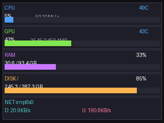

# SensorPanel

[](https://github.com/alperen/sensorpanel/actions/workflows/ci.yml)
[](https://goreportcard.com/report/github.com/alperen/sensorpanel)
[](https://opensource.org/licenses/MIT)

A cross-platform CLI tool for driving USB LCD displays as real-time system monitoring dashboards.



## Features

- **Multi-device support** - Modular device profiles for different USB displays
- **Easy device contribution** - Interactive wizard to add support for new panels
- **Real-time monitoring** - CPU, GPU (NVIDIA/AMD), RAM, disk, and network stats
- **Web-based themes** - Create custom themes using React + TypeScript
- **TypeScript SDK** - React hooks for easy theme development
- **Single-command dev** - One command starts everything for theme development
- **Headless rendering** - Auto-downloads Chrome for Testing to render themes
- **Cross-platform** - Works on Linux, macOS, and Windows
- **NixOS support** - Flake with module, udev rules, and systemd service

## Quick Start

### 1. Build

```bash
# With Mage (recommended)
go install github.com/magefile/mage@latest
mage build

# Or directly with Go
go build .

# Or with Nix
nix build
```

### 2. Select your display

```bash
./sensorpanel device list     # See available devices
./sensorpanel device select   # Interactive selection
```

### 3. Run the dashboard

```bash
# With built-in renderer
./sensorpanel run

# Or create and use a custom theme
./sensorpanel theme create my-theme
./sensorpanel theme select my-theme
./sensorpanel run
```

## Supported Devices

SensorPanel uses a modular device profile system. Currently supported:

| Device | Resolution | Color Format | Notes |
|--------|------------|--------------|-------|
| QTKeJi/AIDA64 USB Display | 480x320 | RGB565 BE | VID 0x1908 |
| Generic AX206-based frames | Various | RGB565 | GEMBIRD, Pearl, Coby, etc. |

**Don't see your device?** Run `sensorpanel device create` to add support for it!

## Commands

### Run Dashboard

```bash
sensorpanel run [flags]

Flags:
  -i, --interval float   Update interval in seconds (default 1.0)
  -b, --brightness int   Backlight brightness 0-7 (default 7)
  -m, --mounts strings   Disk mount points to monitor (default [/])
      --cpu              Show CPU stats (default true)
      --gpu              Show GPU stats (default true)
      --ram              Show RAM stats (default true)
      --disk             Show disk stats (default true)
      --network          Show network stats (default true)
```

### Device Management

```bash
sensorpanel device list      # List connected USB displays
sensorpanel device select    # Interactive device selection
sensorpanel device info      # Show current device and profile info
sensorpanel device create    # Generate code for new device support
sensorpanel device reset     # Reset to defaults
```

### Theme Management

```bash
sensorpanel theme list              # List installed themes
sensorpanel theme create <name>     # Create from React+TypeScript template
sensorpanel theme select <name>     # Set active theme
sensorpanel theme dev [name]        # Start dev server (auto-detects package manager)
sensorpanel theme build [name]      # Build theme for production
sensorpanel theme preview [name]    # Open in browser
sensorpanel theme delete <name>     # Remove theme
sensorpanel theme path              # Show themes directory
sensorpanel theme browser install   # Download Chrome for Testing
sensorpanel theme browser status    # Check browser availability
sensorpanel theme browser remove    # Remove cached browser
```

### Panel Control

```bash
sensorpanel panel status       # Check if panel is connected
sensorpanel panel test         # Display test pattern
sensorpanel panel on           # Turn backlight on
sensorpanel panel off          # Turn backlight off
sensorpanel panel brightness 5 # Set brightness (0-7)
```

### Other Commands

```bash
sensorpanel benchmark          # Measure FPS performance
sensorpanel prune              # Remove config and cache (keeps themes)
sensorpanel prune --all        # Also remove themes
```

## Adding Device Support

Got a USB display that isn't supported yet? Adding support is easy:

```bash
# Run the interactive wizard
./sensorpanel device create
```

This prompts you for:
- Device name and ID
- USB Vendor ID and Product ID
- Display resolution
- Color format (RGB565/RGB888) and byte order
- Backlight levels

It generates a skeleton Go file in `pkg/device/` that you can customize.

See [docs/adding-devices.md](docs/adding-devices.md) for detailed protocol research tips.

## Theme Development

Themes are React + TypeScript applications that receive sensor data via WebSocket. A bundled SDK provides React hooks for easy integration.

### Create a theme

```bash
sensorpanel theme create my-theme
```

### Development workflow (single command!)

```bash
# Start everything with one command:
sensorpanel theme dev my-theme

# This automatically:
# - Detects your package manager (npm/yarn/pnpm/bun)
# - Installs dependencies if needed
# - Starts WebSocket sensor server (port 19847)
# - Starts Vite dev server with HMR (port 15173)
# - Opens your browser
```

### Using the SDK

```tsx
import { useSensorData, useConnectionStatus, formatRate } from "../lib/sensorpanel";

function App() {
  const data = useSensorData();
  const status = useConnectionStatus();

  if (status !== "connected" || !data) {
    return <div>Connecting...</div>;
  }

  return (
    <div>
      <p>CPU: {data.cpu.load.toFixed(0)}%</p>
      <p>GPU: {data.gpu.temperature?.toFixed(0) ?? "--"}°C</p>
      <p>RAM: {data.memory.percent.toFixed(0)}%</p>
    </div>
  );
}
```

### Build and use

```bash
sensorpanel theme build my-theme
sensorpanel theme select my-theme
sensorpanel run
```

See [docs/creating-themes.md](docs/creating-themes.md) for the full guide.

## NixOS Installation

### Add to your flake.nix

```nix
{
  inputs = {
    nixpkgs.url = "github:NixOS/nixpkgs/nixos-unstable";
    sensorpanel.url = "github:alperen/sensorpanel";
  };

  outputs = { self, nixpkgs, sensorpanel, ... }: {
    nixosConfigurations.yourhostname = nixpkgs.lib.nixosSystem {
      system = "x86_64-linux";
      modules = [
        ./configuration.nix
        sensorpanel.nixosModules.default
        {
          services.sensorpanel = {
            enable = true;
            interval = 1.0;
            brightness = 7;
            theme = "my-theme";  # or null for built-in renderer
          };
        }
      ];
    };
  };
}
```

### Module options

```nix
services.sensorpanel = {
  enable = true;
  interval = 1.0;        # Update interval in seconds
  brightness = 7;        # Backlight brightness (0-7)
  theme = null;          # Theme name or null for built-in
  diskMounts = [ "/" ];  # Mount points to monitor
  user = "sensorpanel";  # Service user
  group = "sensorpanel"; # Service group (for USB access)
};
```

## File Locations

| Type | Path |
|------|------|
| Config | `~/.config/sensorpanel/config.json` |
| Themes | `~/.local/share/sensorpanel/themes/` |
| Browser cache | `~/.cache/sensorpanel/browser/` |

## Architecture

### Device Profiles

Each USB display is supported via a device profile that implements:

```go
type DeviceProfile interface {
    ID() string                           // "qtkeji", "my-device"
    Name() string                         // Human-readable name
    Matches(vid, pid uint16) bool         // USB device matching
    Width() int                           // Display width
    Height() int                          // Display height
    ColorFormat() ColorFormat             // RGB565 or RGB888
    ByteOrder() ByteOrder                 // BigEndian or LittleEndian
    BlitCommand(x, y, w, h, len int) []byte  // Build display command
    BacklightCommand(level int) []byte    // Build backlight command
    ConvertImage(img image.Image) []byte  // Convert to device format
}
```

### Sensor Sources (Linux)

| Metric | Source |
|--------|--------|
| CPU Load | `/proc/stat` |
| CPU Temp | `/sys/class/hwmon/*/temp*_input` |
| CPU Freq | `/sys/devices/system/cpu/cpu0/cpufreq/scaling_cur_freq` |
| GPU (NVIDIA) | `nvidia-smi` |
| GPU (AMD) | `/sys/class/drm/card*/device/` |
| RAM | `/proc/meminfo` |
| Disk | `syscall.Statfs` |
| Network | `/proc/net/dev` |

## Troubleshooting

### Device not found

```bash
# List USB devices
lsusb

# Check if sensorpanel detects it
./sensorpanel device list
```

If your device shows in `lsusb` but not in sensorpanel, it may need a new device profile. Run `sensorpanel device create` to add support.

### Permission denied

Create a udev rule for your device:

```bash
# Replace XXXX and YYYY with your device's VID and PID
sudo tee /etc/udev/rules.d/99-sensorpanel.rules << EOF
SUBSYSTEM=="usb", ATTR{idVendor}=="XXXX", ATTR{idProduct}=="YYYY", MODE="0666"
EOF

sudo udevadm control --reload-rules
sudo udevadm trigger
```

On NixOS with the module, udev rules are set up automatically for known devices.

### Theme not rendering

```bash
# Check if browser is installed
sensorpanel theme browser status

# Install browser if needed
sensorpanel theme browser install

# Check theme is built
ls ~/.local/share/sensorpanel/themes/my-theme/dist/
```

### No GPU stats

```bash
# NVIDIA: Check nvidia-smi works
nvidia-smi

# AMD: Check sysfs
ls /sys/class/drm/card*/device/gpu_busy_percent
```

## Contributing

Contributions are welcome! See [CONTRIBUTING.md](CONTRIBUTING.md) for guidelines.

### Ways to contribute

- **Add device support** - Run `sensorpanel device create` and submit a PR
- **Create themes** - Share your themes with the community
- **Improve docs** - Help others get started
- **Fix bugs** - Check the issue tracker

## License

MIT License - See LICENSE file for details.
